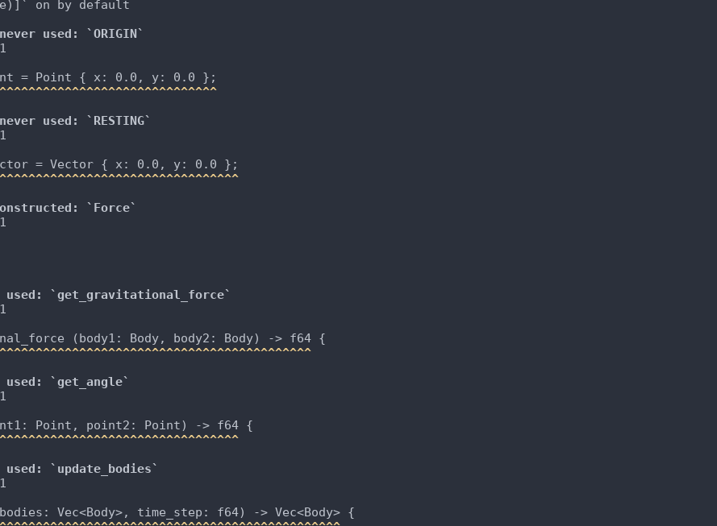

Howdy y'all, I'm making a n-body rust simulation to help me learn the language. The goal is a simple example of a rust rendering + logic pipeline to serve as an example for others.

`cargo test` runs the tests

`cargo run` launches the app, args are time_step, x_coord, y_coord, x_velocity, y_velocity. Such as: `cargo run 3 0 150 -0.5 0`